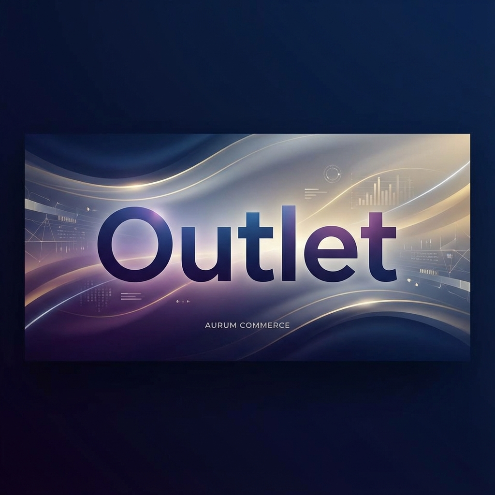

# 🛍️ Outlet - Microservice Ecommerce Platform



Outlet is a modern, scalable e-commerce platform built with a **Microservices Architecture**. It leverages high-performance tools like **Bun**, **TypeScript**, and **mprocs** to provide a seamless development and production experience.

---

## 🚀 Key Features

- **Microservices Architecture**: Decoupled services for authentication, emails, and platform logic.
- **Unified API Gateway**: Single entry point handling routing and security for all client applications.
- **Suite of Client Portals**:
  - **Outlet Web**: The high-performance customer-facing storefront.
  - **Admin Portal**: Comprehensive dashboard for platform-wide management.
  - **Company Portal**: Dedicated space for vendors and business partners.
  - **Outlet App**: A unified experience for mobile users.
- **Powered by Bun**: Blazing fast runtime for both development and deployment.
- **Type-Safe Development**: Entirely written in TypeScript for robust and maintainable code.

---

## 🏗️ Architecture Overview

The platform is architected to handle scale and complexity by separating concerns into specialized layers:

### 1. Gateway Layer
- **API Gateway**: A custom Bun-based reverse proxy that routes traffic to the appropriate backend services, providing a unified API surface.

### 2. Service Layer (`/services`)
- **Auth Service**: Manages the entire authentication lifecycle, including user registration, JWT-based sessions, and RBAC (Role Based Access Control).
- **Email Service**: A dedicated service for handling transactional emails, notifications, and marketing campaigns.

### 3. Client Layer (`/clients`)
- **Outlet Web**: The main e-commerce storefront.
- **Admin Portal**: Platform management tool for admins.
- **Company Portal**: Vendor management and business analytics.
- **Outlet App**: Mobile client application.

---

## 🛠️ Tech Stack

| Component | Technology |
| :--- | :--- |
| **Runtime** | [Bun](https://bun.sh/) |
| **Language** | [TypeScript](https://www.typescriptlang.org/) |
| **Process Manager** | [mprocs](https://github.com/pvolok/mprocs) |
| **Frontend** | React / Next.js |
| **Gateway** | Custom Bun Reverse Proxy |

---

## 🚦 Getting Started

### Prerequisites

- [Bun](https://bun.sh/) (latest version)
- [mprocs](https://github.com/pvolok/mprocs) (recommended for multi-service management)
- Node/NPM (optional, Bun preferred)

### Installation

1. Clone the repository:
   ```bash
   git clone https://github.com/lwshakib/outlet-ecommerce-platform-using-microservice-architecture.git
   cd outlet-ecommerce-platform-using-microservice-architecture
   ```

2. Install dependencies across all packages:
   ```bash
   bun install
   ```

### Running the Platform

To start the entire ecosystem (Gateway, Services, and Clients) in a single terminal window, use `mprocs`:

```bash
mprocs
```

To run a specific component individually:

```bash
# Example: Start the Auth Service
cd services/auth-service && bun dev
```

---

## 🤝 Contributing

Contributions are what make the open-source community such an amazing place to learn, inspire, and create. Any contributions you make are **greatly appreciated**.

Please refer to [CONTRIBUTING.md](CONTRIBUTING.md) for detailed guidelines on how to contribute to this project.

## 📜 Code of Conduct

We are committed to providing a friendly, safe, and welcoming environment for all. Please review our [Code of Conduct](CODE_OF_CONDUCT.md).

## 📄 License

Distributed under the MIT License. See `LICENSE` for more information.

## 👨‍💻 Author

**lwshakib**
- GitHub: [@lwshakib](https://github.com/lwshakib)

---
*Built with ❤️ by [lwshakib](https://github.com/lwshakib)*